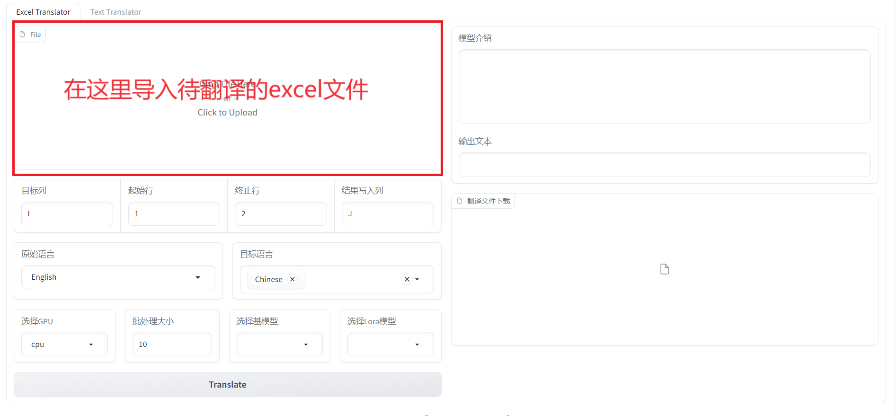
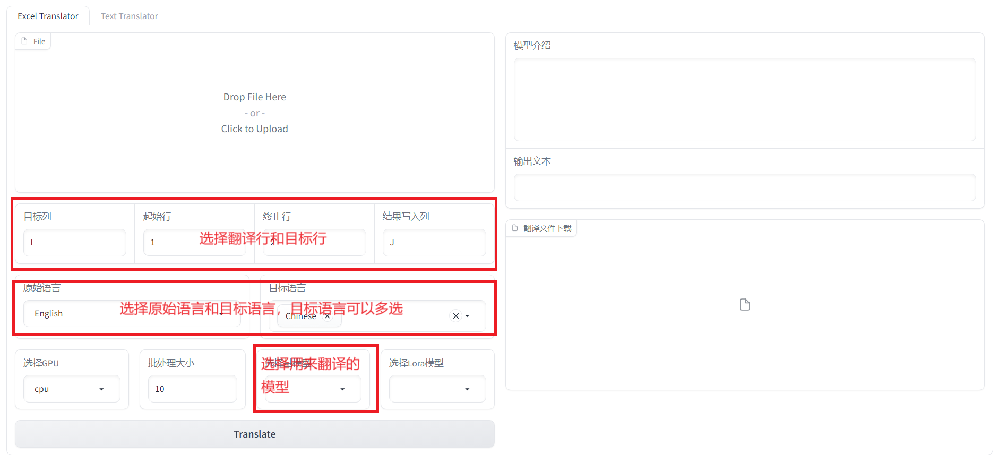
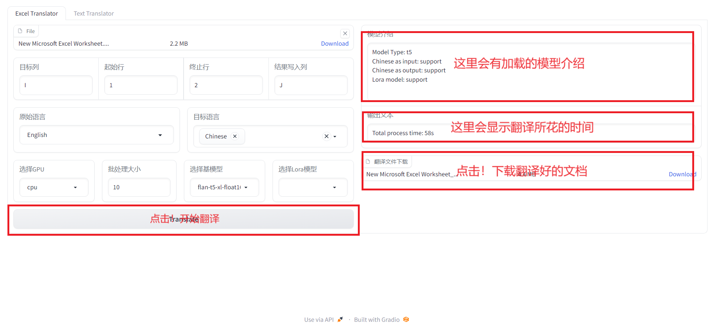
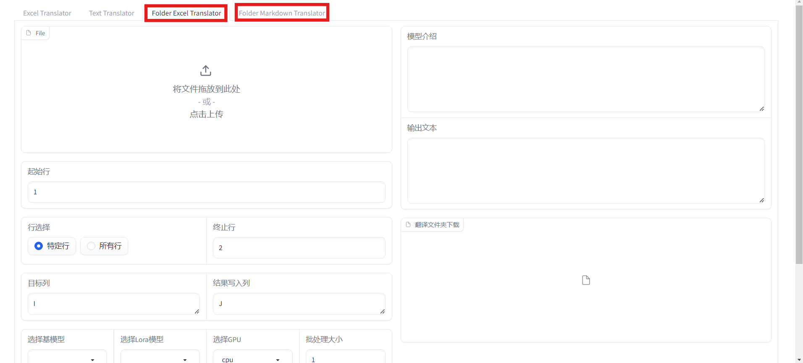

---

# AI Translator 安装说明

## **一、 环境设置（推荐使用 Conda）**

为了确保项目依赖的隔离和稳定性，我们强烈建议您使用 Anaconda 或 Miniconda 来管理 Python 环境。Miniconda 是一个轻量级的 Anaconda 版本，仅包含 Conda 包管理器和 Python。

### 1\. 下载并安装 Miniconda

首先，您需要根据您的操作系统下载并安装 Miniconda。

- **下载地址:** [https://docs.conda.io/en/latest/miniconda.html](https://docs.conda.io/en/latest/miniconda.html)

请访问以上链接，选择与您的操作系统（Windows, macOS, or Linux）和架构（64-bit）相对应的最新 Python 版本的安装包。

下载后，双击安装程序并按照屏幕上的提示完成安装。建议在安装过程中选择“将 Conda添加到我的 PATH 环境变量中”（"Add Anaconda to my PATH environment variable"），但这对于有经验的用户是可选的。

### 2\. 创建并激活 Conda 环境

安装完成后，打开您的终端（在 Windows 上是 Anaconda Prompt 或命令提示符/PowerShell，在 macOS/Linux 上是终端）。

然后，使用以下命令来创建一个名为 `ai-trans` 的新环境。我们推荐使用 Python 3.10 或更高版本。

```bash
conda create --name ai-trans python=3.10
```

Conda 会询问您是否要继续，输入 `y` 并按回车。

环境创建成功后，使用以下命令激活该环境：

```bash
conda activate ai-trans
```

当您看到终端提示符前面出现 `(ai-trans)` 字样时，表示您已成功进入该环境。接下来的所有操作都将在这个独立的环境中进行。

## **二、 安装项目依赖**

### 从 requirements.txt 安装其他包

请确保您已经激活了 `ai-trans` 环境。然后，在项目根目录下，运行以下命令来安装所有必需的第三方库：

```bash
pip install -r requirements.txt
```

## **三、 配置环境变量**

在启动程序之前，您需要配置API密钥等敏感信息。

### 1\. 创建 .env 文件

首先，将 `src` 目录下的 `.env.example` 文件复制一份并重命名为 `.env`。这是存放您个人配置的地方。

您可以在终端中执行以下命令：

**在 macOS 或 Linux 上:**

```bash
cp src/.env.example src/.env
```

**在 Windows 上:**

```bash
copy src\\.env.example src\\.env
```

### 2\. 添加你的 API 密钥

接下来，用文本编辑器（如 VS Code、记事本等）打开刚刚创建的 `src/.env` 文件。

您会看到类似下面的内容：

```ini
# 请在这里填入你的API Key
OPENAI_API_KEY="YOUR_API_KEY_HERE"
```

请将 `"YOUR_API_KEY_HERE"` 等占位符替换成**您自己真实的 API 密钥**，然后保存文件。

## **四、 启动程序**

在您的 Python 项目平台（如 PyCharm、VS Code...）的终端中，确保您已经完成了以上所有步骤，并且已经激活了 `(ai-trans)` 环境。

使用以下命令启动 AI 翻译器：

```bash
cd src
nohup python main_ui.py &
```

# AI Translator 使用说明

## 第一步：



## 第二步：



## 第三步：



应用提供了Excel批量翻译功能和markdown批量翻译功能，如果Excel格式类似，可以通过指定翻译列和写入列，批量翻译Excel



## 一键部署

把文件：`./deploy/ai_translator.ipynb 放到Google drive里，双击用Colab打开，点击一键部署即可`
