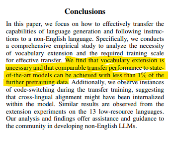

[English](README.md) | [中文](README_CN.md)

## AI_Translator 安装说明

## 安装 NVIDIA Driver

[NVIDIA 驱动下载链接](https://www.nvidia.com/download/index.aspx)

安装完成后，运行以下指令看是否安装成功：

```
nvidia-smi
```

### 安装 NVIDIA Toolkit

[NVIDIA Toolkit 下载链接](https://developer.nvidia.com/cuda-downloads)

安装完成后，运行以下指令看是否安装成功：

```
nvcc --version
```

### 安装支持 GPU 的 PyTorch 版本

```
pip3 install torch torchvision torchaudio --index-url https://download.pytorch.org/whl/cu118
```

### 从 requirements 安装其他包

```
pip3 install -r requirements.txt
```

## **从 huggingface 安装模型**

导航至特定文件夹下载模型，运行以下代码：

```
git lfs install
git clone git@hf.co:
```

## **启动：**

在你的 Python 项目平台（如 PyCharm、Vscode...）的终端中，

使用以下命令享受 AI 翻译器：

`launch.py`

# AI_Translator 使用说明

## 第一步：


## 第二步：


## 第三步：


## 一键部署

把文件：`./deploy/ai_translator.ipynb 放到Google drive里，双击用Colab打开，点击一键部署即可`

## 关于微调

实现了针对mbart模型和nllb模型的微调，mbart采用原始语言到目标语言的微调，nllb采用双语言互译微调。同时添加了对词库扩充的支持。

但是在训练集较小时不必要使用词库扩充功能，参考：[https://arxiv.org/pdf/2401.01055.pdf](https://arxiv.org/pdf/2401.01055.pdf)


